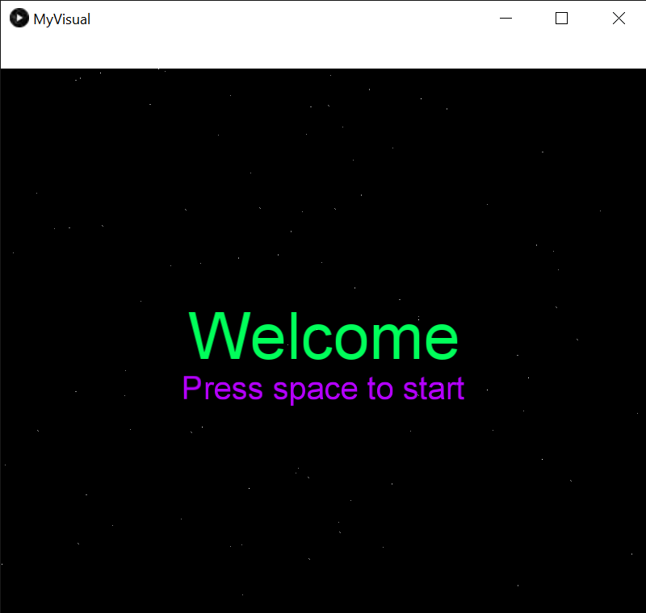

# Music Visualiser Project

Name: Rachel Finucane

Student Number: C18735641 

# Description of the assignment

[](https://www.youtube.com/watch?v=NGQbYEESZEg)

This is a visual accompaniment to the track *"Obsession*" by Joywave. There is a welcome screen, a background visual, some text, and 5 visuals that interact 
with the music. Hitting spacebar starts the visuals. Each visual displays in turn based on the timestamp of the track.

# Instructions
Navigate to *C:\Users\rache\Documents\OOP_java\MusicVisuals\java* and run the compile.sh file on Windows or mcompile.sh on Mac. 
To run the project, click *run.sh* on Windows, or the *mrun.sh* file for Mac.
You should see the welcome screen. To run the music visuals, press the spacebar. The visuals automatically transition at appropriate times, so no need to press any 
buttons to see them. To go back to the beginning of the track (and visuals), press the spacebar again.

# How it works
MyVisual.java is a subclass of Visual, which extends PApplet. This is the java file that controls all other objects and sketches.
The instance of the MyVisual object is passed to each sketch, so that they can access the PApplet methods to draw to the screen.
MyVisual determines when these sketches run.
## MyVisual (The UI)

Each sketch is instantiated - for most we only need one object, but I decided to create three message objects to display a phrase of the song to the screen.

```Java
 loadAudio("Joywave - 01. Obsession.mp3");

        fl = new Flower(this);
        cv = new ClusterVisual(this);
        zv = new ZoomVisual(this);
        bz = new BoxZoom(this);
        tv = new TreeVisual(this);
        we = new Welcome(this);
        obsess = new Message(this, "OBSESSION", 100);
        hold = new Message(this, "hold in my sights", 50);
        get = new Message(this, "get me through the night", 50);
        no = new Noise(this);
```

Pressing the spacebar starts the audio playing, and sets a flag that the audio has begun. This flag is initially *false*, so that the welcome screen can display.

```Java
if (key == ' ') {
            started = true;
            getAudioPlayer().cue(0);
            getAudioPlayer().play();
        }
```

#### The draw() method

The current position of the audio is found. This is used to trigger different sketches rendering.

```Java
float position = getAudioPlayer().position();
```

Before playback begins, the welcome screen is displayed, with a background of particle effects.

```Java
if (started == false) {
            we.render();
            no.render();
        } 
				```
				
Once playback begins, MyVisual compares the current playback position to timestamps for various triggers. When it is between one trigger and the next, 
it renders the appropriate sketch. Below is an extract from this code.

				```Java
				
				else {

            if (position > 0 && position < t1) {
                fl.render();
                no.render();
            } else if (position > t1 && position < t2) {
                tv.render();
                no.render();
            }
```

Text is displayed alongside some images to coincide with lyrics in the chorus of the song. 

```Java            
            if (position > m1 && position < m1 + mLength) {
                obsess.render();
            } 
            else if (position > m2 && position < m2 + mLength) {
                get.render();
            } 

```

## The Sketches

### Box Zoom Visual


#### BoxZoom.java

This class creates an arraylist of cube objects, each with starting co-ordinates of random x, y and z values. There are as many cubes as there are audio bands,
and the size of each cube corresponds to its audio band.

```Java
 boxes = new ArrayList<MyCube>();
        for (int i = 0; i < numBoxes; i++) {
            x = mv.random(-mv.width / 6, mv.width / 6);
            y = mv.random(-mv.height / 6, mv.height / 6);
            z = mv.random(-mv.height / 2, mv.height / 2);
            boxes.add(new MyCube(mv, boxSize, x, y, z, margin));
						
```

Every time the screen refreshes, each object in the arraylist is rendered on screen. The current frequency band is passed to the box's render method.

```Java
b.render(mv.getSmoothedBands()[i]);
```

#### MyCube.java

The size of the box to be drawn is calculated based on the frequency band, using the map() method. The MyCube.java class has x, y and z attributes that are not
reset every screen refresh. The render() method translates to the x, y and z co-ordinates and draws a box. Since the boxes are moving towards the screen, the z
value is increased - but if it reaches an upper limit, the z value is reset, and the x and y co-ordinates are set to random, making it appear at a random point
at the back of the screen.

```Java
				freqBandSize = MyVisual.map(freqBand, 0, 1000, size / 2, size * 2);
        speed = mv.getSmoothedAmplitude() * 10;
        mv.noFill();
        mv.stroke(255);
        mv.pushMatrix();
        mv.translate(mv.width / 2, mv.height / 2);
        mv.translate(x, y, z);
        mv.box(freqBandSize);
        mv.popMatrix();
        z += speed;

        if (z > mv.height / 2)
        {
            x = mv.random(-mv.width / 6, mv.width / 6);
            y = mv.random(-mv.height / 6, mv.height / 6);
            z = -mv.height;
        }
    }
```
	
### Cluster Visual


This visual manipulates concentric "circles" of spheres using rotations to achieve a cluster effect. 

#### Without any rotations:


The outer for loop draws each "row" of spheres, and the inner for loop draws each individual sphere. The position of each sphere in the circle is 
calculated using trigonometry. The inner for loop draws two sets of spheres - one as the 
"northern hemisphere", and one as the "southern hemisphere" - the second is rotated around the x-axis by PI radians.

#### A single "hemisphere":


#### Just inner for loop rotation:


#### Just outer for loop rotation:


Each row of spheres has a diameter and a colour corresponding to a frequency band.


```Java
 for (int i = 0; i < numSpheres; i++) {
            colour = MyVisual.map(i, 0, numSpheres, 0, 255);
            mv.noStroke();
            mv.fill(colour, 255, 255);
            offset = radius * i;
            mv.pushMatrix();
            for (int j = 0; j < numSpheres + 2 * i; j++) {

                freqBandRadius = MyVisual.map(mv.getSmoothedBands()[i], 0, 1000, 0.4f * radius, 1.6f * radius);
                angle = MyVisual.map(j, 0, numSpheres + 2 * i, 0, MyVisual.TWO_PI);

                mv.pushMatrix();
                X = MyVisual.cos(angle) * (dist + offset);
                Y = -MyVisual.sin(angle) * (dist + offset);
                mv.translate(X, Y, 0);

                mv.sphere(freqBandRadius);
                mv.popMatrix();

                mv.pushMatrix();
                mv.rotateX(MyVisual.PI);
                X = MyVisual.cos(angle) * (dist + offset);
                Y = -MyVisual.sin(angle) * (dist + offset);
                mv.translate(X, Y, 0);

                mv.sphere(freqBandRadius);
                mv.popMatrix();

                mv.rotateX(MyVisual.TWO_PI / (numSpheres + ( 2 * i)));
            }
            mv.popMatrix();
            mv.rotateX(MyVisual.TWO_PI / (numSpheres));
        }
``` 

### Flower/Lotus Visual


Again, a nested for loop is used to achieve this shape. The outer for loop draws each row of petals, and the inner for loop draws the individual petal.
The length of the petals in each band corresponds to a frequency band, and is calculated using the map() method. 
The inner for loop works by placing a petal, then rotating the matrix around the centre of the flower, ready to place another petal. The petals are also rotated 
around the x-axis to make them 3D, rather than lying flat. The first row lies flat and each subsequent inner row is raised to a greater and greater angle.
This is achieved by mapping the i value onto a range from 0 to pi radians, and then rotating around the x-axis by that amount.

```Java
for (int i = 0; i < numRows; i++) {

            mv.fill(rColor, 255, 255);
            pY = MyVisual.map(mv.getSmoothedBands()[i], 0, 1000, mv.height / 12, mv.height / 2);

            for (int j = 0; j < numPetals; j++) {
                rowAngleOffset = MyVisual.map(i, 0, numPetals, MyVisual.HALF_PI, 0);
                mv.pushMatrix();
                mv.rotateX(rowAngleOffset);
                mv.ellipse(rX, rY + (pY / 2), pX, pY);
                
                mv.popMatrix();
                mv.rotate(MyVisual.TWO_PI / numPetals);
            }
            
            // offset petals for next row
            mv.rotate(pOffset);

            // reduce petal size
            pY = pY * 0.9f;
            rColor += (255 / numRows);
        }
```

### Message


The message is repeated a number of times, fading and moving down the y-axis each time. This adds depth to the image. The colour cycles through the colour wheel.

```Java
for (int i = 0; i < numWords; i++) {
            mv.textSize(size);
            mv.fill(colour, 255, fade);
            mv.text(message, 0, 0);
            colour = (colour + 1) % 255;
            mv.translate(0, yTransform, -yTransform);
            fade = fade / 3;
        }``` 
				
The message moves slowly back and forth around the y-axis by increasing and decreasing the angle of rotation.

```Java
if (increasing == true) {
            angle += 0.001;

            if (angle > MyVisual.PI * 0.05) {
                increasing = false;
            }
        }

else {
		angle -= 0.001;
		if (angle < -MyVisual.PI * 0.05) {
				increasing = true;
		}
}
				
				```
				
### Noise (Background)

This adds some interest to the background. 200 points are displayed at random x and y co-ordinates on the background.

```Java
public void render()
    {
        int numPoints = 200;
        mv.stroke(255);
        for(int i = 0; i < numPoints; i++)
        {
            mv.point(mv.random(mv.width ), mv.random(mv.height), mv.random(mv.width / 2));
        }
    }
		
		```
### Welcome Screen



```Java
    public void render() {
        String title = "Welcome";
        String subtitle = "Press space to start";
        float titleSize = mv.width / 10f;
        float subtitleSize = mv.width / 20f;

        int titleFill = 100;
        int subtitleFill = 200; 

        mv.textAlign(MyVisual.CENTER);
        mv.fill(titleFill, 255, 255);
        mv.textSize(titleSize);

        mv.text(title, mv.width / 2, mv.height / 2);
        mv.fill(subtitleFill, 255, 255);
        mv.textSize(subtitleSize);
        mv.text(subtitle, mv.width / 2, mv.height / 2 + 50);
        mv.rotateY(angle);

    }
		
`````

### Tree Visual


The concept for this visual comes from [hyperlink](https://processing.org/examples/tree.html)

The method translates the matrix to the bottom of the screen, and it draws a branch from that point to form a trunk. It translates to the top of the trunk
and begins the recursive drawing of the tree.

```Java
public void render() {
        mv.pushMatrix();
        mv.stroke(255);
        mv.pushMatrix();
        mv.translate(mv.width / 2, mv.height - margin);
        drawBranch(branchHeight);
        mv.popMatrix();
        mv.translate(mv.width / 2, mv.height - margin - branchHeight);
        drawSelf(branchHeight);

        angle = MyVisual.map(mv.getSmoothedAmplitude(), 0, 1, 1f * staticAngle, 1.5f * staticAngle);
        mv.popMatrix();
    }

```

This method calls itself until the length of the current generation of branches is 30 or less. It works by starting at the end of the previous branch, 
rotating the appropriate angle, drawing the new branch, then translating to the end of this new branch. It then recursively calls itself to draw the next
generation of branches. This continues until the branch is too small to continue. It then returns to the previous branch and goes in the opposite direction, 
drawing the branches in order of depth-first, rather than breadth-first.

The angle of the branches changes with the amplitude of the music.

```Java
private void drawSelf(float bHeight) {
        bHeight = bHeight * branchReduction;
        if (bHeight > 30) {

            mv.pushMatrix();
            mv.rotate(angle);
            drawBranch(bHeight);
            mv.translate(0, -bHeight);
            drawSelf(bHeight);
            mv.popMatrix();

            mv.pushMatrix();
            mv.rotate(-angle);
            drawBranch(bHeight);
            mv.translate(0, -bHeight);
            drawSelf(bHeight);
            mv.popMatrix();

        }

    }
```

This method draws the branches for the tree. It is a collection of lines that are drawn around a centre in a circular pattern. The radius of this circle depends 
on the amplitude. Once the branches start to get small enough, they draw leaves.

```Java
			private void drawBranch(float bHeight) {
        int numLines = mv.getBands().length;
        float distance = MyVisual.map(mv.getSmoothedAmplitude(), 0, 1, trunkMin, trunkMax);
        float lnAngle;

        float x, z;
				for (int i = 0; i < numLines; i++) {
            lnAngle = MyVisual.map(i, 0, numLines, 0, MyVisual.TWO_PI);

            x = MyVisual.cos(lnAngle) * distance;
            z = MyVisual.sin(lnAngle) * distance;

            mv.line(x, 0, z, x, -bHeight, z);
        }
        if (bHeight < branchHeight / 4) {
            drawLeaves(bHeight);
        }
			}
```

Leaves are drawn in a circle with the end of the branch as their centerpoint. Each leaf corresponds to a frequency band in amplitude and colour.


```Java
					for (int i = 0; i < numLines; i++) {
            colour = MyVisual.map(i, 0, numLines, 0, 255);
            leafHeight = MyVisual.map(mv.getSmoothedBands()[i], 0, 1000, leafMin, leafMax);
            mv.fill(colour, 255, 255);
            mv.noStroke();
            mv.ellipse(leafHeight * 1.5f, 0, leafHeight, distance);
            mv.rotate(MyVisual.TWO_PI / numLines);

        }
```


### Zoom Visual


Concentric circles are drawn from the outside of the screen inwards, getting smaller as they go. This overcomes the problem of more recently drawn objects
appearing on top of everything else. Each circle has its own colour. When no music is playing, each circle is static on the screen. The diameter of each successive
ellipse is reduced by the screen diagonal/the number of circles. This means that they are evenly distributed across the screen. A similar approach is taken
with the colour of each ellipse.

When the music begins to play, each circle gets smaller by an amount relating to the amplitude of the music. This disrupts the even placement of the circles
and makes it appear as though they are "zooming".

```public void render() {

        float colour = 0;
        float max = (float) Math.sqrt(mv.height * mv.height + mv.width * mv.width);
        float curr = max;
        int numCircs = 20;
        float colourInc = 255 / numCircs;
        float speed = max / numCircs;
        int maxSpeed = 100;

        mv.noStroke();
        mv.translate(mv.width / 2, mv.height / 2);
        while (curr > 0) {
            colour = (colour + colourInc) % 255;
            mv.fill(colour, 255, 255);
            mv.circle(0, 0, curr);

            if (mv.getAmplitude() > 0) {
                curr -= speed - MyVisual.map(mv.getSmoothedAmplitude(), 0, 1, 0, maxSpeed);
            } else {
                curr -= speed;
            }

        }

    }
```


# What I am most proud of in the assignment
I am most proud of the lotus sketch. I think it is my most beautiful drawing. Working out the placement of each row and petal required time, maths, and lots of 
paper sketches. I am also proud of the zooming circles visual. It took me a long time to work out how to draw each circle so that the colour changed smoothly
 while each circle moved. I am pleased with the overall timing of the piece - each timestamp coincides with a change in the music and each transition works well.

I am also proud of my use of git. Once I started working on actual features for the project, I developed them in their own branches, merging them back into 
the master branch once I was finished. I used a nameing scheme: feature_branch_name. I stuck to this naming scheme throughout the project. I also gave meaningful
 commit messages while developing each sketch: for example, in feature_cluster: *"made circle of spheres that expands and contracts based on amplitude"*. I can
  track my changes well over time. I also have over 70 commits, which I am very proud of.
	
	

